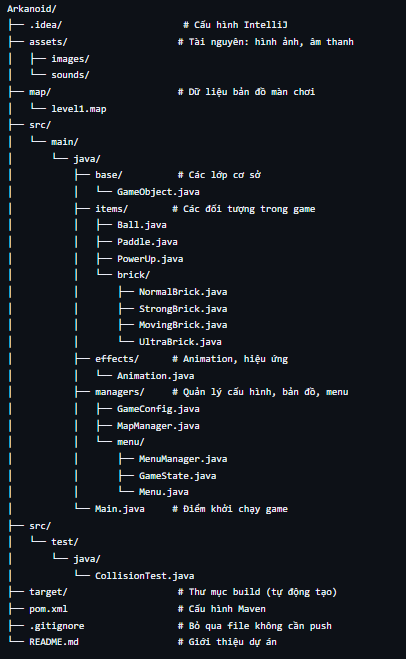

# Arkanoid_opp
# 🕹️ Space Invaders Clone

Một phiên bản đơn giản của game Arkanoid được phát triển bằng Java và thư viện JavaFX. Dự án này là một phần của bài tập lớn môn Lập trình hướng đối tượng trường ĐHCN-DHQGHN.

## 🛠️ Công nghệ sử dụng

- Ngôn ngữ: Java
- Thư viện: JavaFX
- IDE: JDK
- Quản lý mã nguồn: Git & GitHub

## 🕹️ Gameplay

- Người chơi điều khiển thanh chắn bằng chuột
- Quả bóng sẽ bật lại khi chạm thanh chắn hoặc tường
- Mục tiêu là phá hết các viên gạch trên màn hình
- Game kết thúc khi bóng rơi xuống đáy màn hình

## ✅ Tính năng đã hoàn thiện

- Va chạm giữa bóng và gạch, thanh chắn, tường
- Tính điểm khi phá gạch
- Hiển thị mạng sống
- Âm thanh khi va chạm
- Các loại gạch đặc biệt (gạch bền, gạch rơi vật phẩm)
- Lưu điểm cao
- Thêm hiệu ứng và animation

## 🔧 Hướng phát triển

- Tạo nhiều màn chơi với độ khó tăng dần

## 📂 Cấu trúc dự án

## 👤 Tác giả

- Nhóm 14:
- Nguyễn Khương Duy
- Đoàn Thế Đức
- Lê Trí Anh
- Đào Vũ Đức Hoàng

## 📽️ DEMO GAME

🎮 Xem video demo tại:
https://drive.google.com/file/d/1ry5pcl5hVSWnOOEvDZszis9pboWRT5-c/view?usp=sharing
